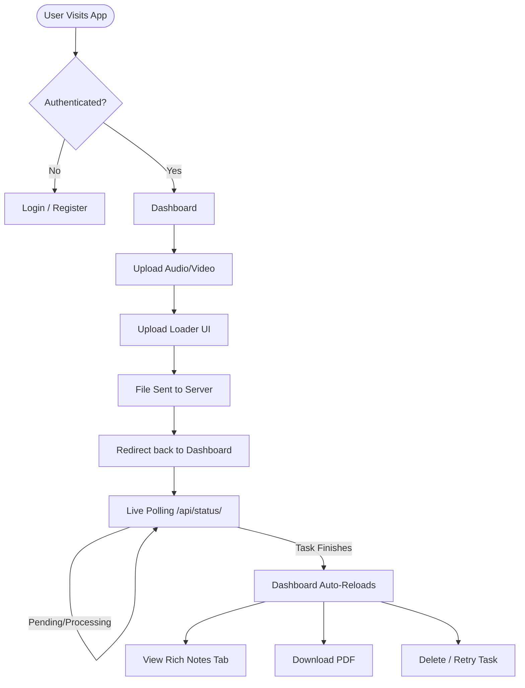
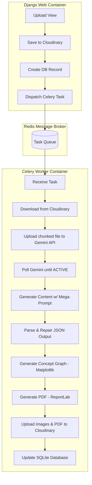

# 🧠 AI Notes Generator (SaaS)


An advanced, production-ready SaaS application that transforms your audio and video lectures into beautifully structured notes, interactive quizzes, concept graphs, and branded PDF documents using Google's powerful Gemini AI pipeline. 

Designed for speed and scale, the application offloads intensive AI processing to background workers, ensuring a seamless and visually stunning frontend experience.

---

## ✨ Comprehensive Feature List

### 🔒 User & Security
- **Secure Authentication**: Full user registration, login, and robust password hashing.
- **Password Recovery**: Secure password reset flow using token verification.
- **Email Verification**: Integrated with Mailtrap for safe email testing in development.
- **Session Management**: Secure, cookie-based session tracking per user.

### 🎥 Media Processing
- **Smart Uploads**: Accepts Audio and Video files (up to 80MB limits).
- **Auto-Detection**: Dynamically detects MIME types to ensure proper routing.
- **Cloud Storage**: Instantly saves media files securely to Cloudinary to bypass local storage limits.

### 🤖 Multimodal AI Analysis (Gemini 2.5 Flash)
- **Executive Summaries**: Distills 40+ minute lectures into concise, high-level paragraphs.
- **Structured Markdown Notes**: Beautifully formatted, deep-dive notes ranging from 600-1500 words.
- **Key Concepts Extraction**: Identifies pivotal terminology with definitions and prioritizes them by importance.
- **Relational Understanding**: Maps how topics connect and flow into one another.
- **Skeleton Outlines**: Generates a quick-glance hierarchical tree of the entire lecture.
- **Automated Quizzing**: Generates comprehensive Q&A pairs for active recall and studying.
- **Resilient AI Pipeline**: Implements `json-repair` to gracefully handle massive LLM token outputs (up to 8192 tokens) and ensure 100% syntactically correct JSON parsing, preventing arbitrary LLM truncation crashes.

### 🎨 Visual & Document Generation
- **Automated Concept Graphs**: Utilizes `NetworkX` and `Matplotlib` to programmatically draw and export high-res visual networks mapping your lecture topics.
- **Branded PDF Export**: Uses `ReportLab` to stitch together notes, summaries, and graphs into a beautifully branded, multi-page PDF document.
- **Interactive Web Graphs**: Renders live `Mermaid.js` diagrams directly in the browser.

### 💻 Frontend / UI
- **Modern Glassmorphism**: A sleek, premium aesthetic utilizing translucent cards, smooth gradients, and deep shadows.
- **Asynchronous UX**: A dynamic Upload Loader overlay that prevents duplicate submissions.
- **Live Polling**: The Dashboard utilizes AJAX to ping the server every 4 seconds, automatically reloading when background tasks finish.
- **Responsive Layouts**: Designed to be viewed flawlessly on desktops, tablets, and mobile devices.

---

## 🏛️ Application Architecture Flows

### 1. GUI Application Flow (User Perspective)



### 2. CLI / Background System Architecture (Backend Perspective)



---

## 🛠️ Technology Stack Breakdown

| Layer | Technology | Purpose |
|-------|------------|---------|
| **Backend** | Django 6.0 | Core routing, ORM, Auth, API endpoints |
| **Language** | Python 3.12 | Modern syntax, robust typing support |
| **AI/ML** | Google Gemini 2.5 Flash | Multimodal media analysis and LLM generation |
| **Messaging** | Redis (Alpine) | In-memory datastore acting as a task broker |
| **Workers** | Celery 5.x | Asynchronous task execution decoupled from web requests |
| **Storage** | Cloudinary | Cloud hosting for Media, Graphs, and PDF documents |
| **Docs** | ReportLab | Programmatic generation of branded PDF files |
| **Data Viz** | NetworkX & Matplotlib | Mathematical graph generation and image plotting |
| **Frontend** | Vanilla CSS + HTML5 | Lightweight, highly customized Glassmorphism design |
| **DevOps** | Docker + Docker Compose | Containerization to guarantee environment consistency |

---

## 🚀 Getting Started Guide

Follow these highly detailed instructions to pull the project and run it on your local machine.

### 1. Prerequisites
Ensure you have the following installed:
- **Python 3.12+**
- **Docker Desktop** (Required to spin up Redis and the Celery worker container)
- **Git** (For pulling the repository)
- Accounts for API Keys:
  - [Google AI Studio](https://aistudio.google.com/) (For Gemini API Key)
  - [Cloudinary](https://cloudinary.com/) (Free tier for cloud storage)
  - [Mailtrap](https://mailtrap.io/) (For safe email testing)

### 2. Clone the Repository
Open your CLI/Terminal and clone the repository to your local machine:
```bash
git clone <your-repository-url>
cd ai_notes_generator
```

### 3. Configure the Environment
Create a `.env` file in the root directory (the same folder that contains `manage.py`) and populate it with your credentials:
```env
# Django Core Settings
SECRET_KEY=your_super_secret_django_key_here
DEBUG=True

# Gemini AI (Core Engine)
GEMINI_API_KEY=your_gemini_api_key

# Cloudinary (Media Hosting)
CLOUDINARY_CLOUD_NAME=your_cloud_name
CLOUDINARY_API_KEY=your_api_key
CLOUDINARY_API_SECRET=your_api_secret

# Email Server (Mailtrap for Auth/Verification)
EMAIL_HOST_USER=your_mailtrap_user
EMAIL_HOST_PASSWORD=your_mailtrap_password
```

### 4. Setup Local Virtual Environment
It is highly recommended to isolate Python dependencies using `venv`:
```bash
# Create the virtual environment
python -m venv venv

# Activate on Windows:
venv\Scripts\activate
# Activate on Mac/Linux:
source venv/bin/activate

# Install all required Python packages
pip install -r requirements.txt
```

### 5. Start Background Workers via Docker
The application relies on Redis and Celery to process large files in the background without freezing the UI.
Ensure Docker Desktop is open, then run:
```bash
docker-compose up -d --build
```
> **Note:** The `docker-compose.yml` is heavily optimized with memory limits and concurrency caps to prevent system lag on lower-end machines (like i3 processors with 8GB RAM).

### 6. Database Migrations
Apply the initial Django database migrations to set up your SQLite DB:
```bash
python manage.py makemigrations
python manage.py migrate
```

### 7. Run the Local Development Server
Start the Django web server:
```bash
python manage.py runserver
```

### 8. Access the Application
Open your preferred web browser and navigate to:
👉 **http://127.0.0.1:8000/**

You can now:
1. Register a new account.
2. Navigate to the Upload page.
3. Upload an Audio or Video file.
4. Watch the Dashboard dynamically update as the AI processes your lecture!

---

## 📂 Project Directory Structure

```text
ai_notes_generator/
│
├── core/                       # Core Django Project settings
│   ├── settings.py             # App configurations & environment loading
│   ├── urls.py                 # Main URL router
│   ├── wsgi.py                 # Deployment interface
│   └── celery.py               # Celery app initialization
│
├── accounts/                   # Authentication App
│   ├── views.py                # Login, Register, Password Reset logic
│   ├── urls.py                 # Auth routing
│   └── templates/accounts/     # Auth UI templates
│
├── notes/                      # Main Application App
│   ├── models.py               # LectureUpload & GeneratedNote schemas
│   ├── views.py                # Dashboard, Upload, and Note Detail logic
│   ├── tasks.py                # The massive AI Pipeline (Celery)
│   ├── urls.py                 # App routing and API polling endpoints
│   └── templates/notes/        # Glassmorphism Dashboard & UI templates
│
├── .env                        # Private environment variables (ignored in Git)
├── .dockerignore               # Optimizes docker build context
├── docker-compose.yml          # Container orchestration (Redis + Celery)
├── Dockerfile                  # Celery worker container blueprint
├── requirements.txt            # Python dependencies
└── manage.py                   # Django execution script
```

---

# Application Modernization & Optimization

## 🚀 Extreme Speed Improvements (Local Storage)
Cloudinary has been completely removed from the pipeline. 
- You will no longer wait for Django to upload the file to Cloudinary.
- You will no longer wait for the Celery worker to download the file from Cloudinary.
- Your AI generation time should now be **30 to 40 seconds faster** for large files because everything is handled instantly on the local disk!
- `MEDIA_ROOT` and `MEDIA_URL` have been configured to securely serve files locally.

## 🎵 Custom Built-in Media Player
A sleek, modern Media Player has been embedded directly above the Notes section on the `note_detail` page.
- Fully custom UI matching the Shadcn / Aceternity design.
- Features custom **Play/Pause**, **Forward 10s**, and **Rewind 10s** buttons.
- Features a responsive, animated progress bar.
- Automatically handles both Audio and Video files flawlessly.

## ✨ Shadcn UI Button Overhaul
All buttons across the app have been overhauled to mimic the highly-sought-after **Shadcn UI** aesthetics:
- `btn-primary`: Now high-contrast (off-white on dark mode) with subtle drop shadows.
- `btn-ghost`: Fully transparent, revealing a subtle muted background on hover.
- Sharp `border-radius: 6px` replacing the overly bubbly borders.
- Crisp focus rings `focus-visible:ring-2` to ensure accessibility and premium interaction feel.


## 🔮 Future Roadmap / Upcoming Features
- [ ] **Vector Database Search**: Implementing a RAG pipeline allowing users to chat directly with their uploaded notes.
- [ ] **AWS S3 Migration**: Swapping Cloudinary for AWS S3 for enterprise-grade scalability.
- [ ] **Live Transcripts**: Extracting timestamped transcripts to click and jump directly to points in the audio.
- [ ] **Production Deployment**: Transitioning from SQLite to PostgreSQL and deploying via Gunicorn/Nginx.
